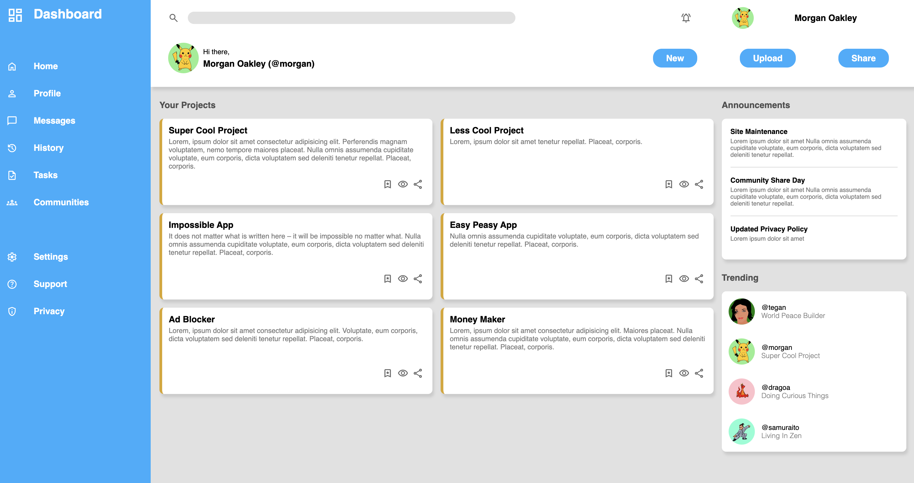

# Admin Dashboard

This project is an **Admin Dashboard** that serves as a functional and visually appealing interface for managing user activities, projects, and system settings. 

See it live here: https://theografiska.github.io/adminDashboard/. 

## Overview
Designed with user experience in mind, the dashboard incorporates:  

- A **sidebar navigation menu** for quick access to key sections like:
  - **Home**
  - **Profile**
  - **Messages**
  - **Tasks**
  - **Settings**
- A **search bar**, **notifications panel**, and **user profile section** for seamless usability.
- **Project cards** to display active projects and their details.
- **Announcements** and **Trending sections** to highlight updates and featured content.

## Features

- **Responsive Design**: Built with **CSS3** to ensure compatibility across devices.  
- **Modern Typography**: Integrated **Google Fonts** for a clean and professional look.  
- **Reusable Components**: Includes project cards, icons, and layouts that can be easily extended.  

